# Ford VIN Share

**Nomes e RM's**

- Vinicius Monteiro Araújo — 555088
- Guilherme Almeida — 555180
- Rafael Duarte de Freitas — 558644
- Rafael Gaspar Bragança Martins — 557228
- Luiz Gustavo da Silva — 558358

App mobile (iOS, Android, Web) pra dois públicos da Ford, na mesma base de
código: o **Cliente** acompanha garantia, agenda serviço, encontra
concessionária, junta pontos e conversa com a IA; o **Analista** acompanha
KPIs de VIN Share, leads em risco, segmentação preditiva e a Visão 360 de
cada cliente.

Não tem mock em lugar nenhum. O app consome o backend Java/Spring Boot do
time (`https://vinshare-api.azurewebsites.net/api/v1`, Postgres), e toda
tela que você vê foi testada puxando dado real de lá.

## Stack

- Expo SDK 54 + React 19 + TypeScript
- expo-router (rotas por arquivo, em `app/`)
- React Query pra cache, retry, refetch e persistência offline
- Zustand só pro essencial — `user`/`role` da sessão atual, nada mais
- axios com interceptor de JWT (Bearer + refresh automático no 401)
- expo-secure-store pros tokens (nunca em AsyncStorage)
- expo-notifications + deep links (`fordapp://`)
- expo-location, com fallback pra São Paulo quando a permissão é negada

## Estrutura

```
FordVINShare/
├── app/                          # expo-router (file-based routes)
│   ├── _layout.tsx               # Stack root + Providers (Query, Push, Deep Links)
│   ├── index.tsx                 # Bootstrap: auto-login via SecureStore
│   ├── (client)/                 # Tabs do cliente (home, scheduling, locator, points, chat, profile)
│   ├── (analyst)/                # Tabs do analista (dashboard, leads, segmentation)
│   ├── appointments.tsx          # "Meus agendamentos"
│   ├── customers/[customerId].tsx
│   ├── nps/[serviceId].tsx
│   └── odometer/[vehicleId].tsx
├── src/
│   ├── components/               # FordLogo, StateBox
│   ├── config/env.ts             # EXPO_PUBLIC_API_URL
│   ├── constants/index.ts        # Design tokens (cores, spacing, radius, tipografia)
│   ├── hooks/                    # hooks de React Query + utilidades
│   ├── screens/                  # telas, separadas em client/ e analyst/
│   ├── services/                 # chamadas à API (axios) + secureStorage + queryPersist
│   ├── types/index.ts            # tipos compartilhados (User, UserRole, IconName)
│   └── utils/                    # store.ts (Zustand), deepLinks.ts, pushNotifications.ts
├── scripts/verify-backend.sh     # smoke test contra o back real
├── app.json                      # config do Expo (inclui o eas.projectId)
├── eas.json                      # perfis de build (development/preview/production)
└── package.json
```

## Rodando o projeto

```bash
npm install
cp .env.example .env      # já vem apontando pro backend no Azure
npm start                 # a = Android, i = iOS, w = Web
```

## O que cada tela faz

**Cliente**

Na Home dá pra ver o status da garantia, alertas de km rodado, os últimos
serviços e um banner quando tem uma pesquisa de satisfação pendente. Agendar
é um passo-a-passo de 3 etapas (serviço → concessionária → data/hora) que
fala direto com `/service-types`, `/dealerships` e `POST /appointments`. O
Localizador usa a geolocalização de verdade do aparelho. Em Pontos dá pra
ver saldo, extrato e resgatar prêmio do catálogo. O chat com a Ford AI
mantém sessão e histórico — quem responde de fato é o backend, integrado
com a API do Gemini; o app só manda a mensagem e mostra a resposta.

**Analista**

O Dashboard reúne os KPIs principais (veículos em garantia, taxa de VIN
Share, receita estimada, leads em risco), um gráfico de VIN Share e o
ranking por concessionária. Leads tem filtro por status
(`NOVO`/`EM_RISCO`/`PERDIDO`/`RECUPERADO`), score de risco e atalho pra
WhatsApp ou ligação. Segmentação mostra a distribuição da base num donut e
o funil de fidelização. E a Visão 360 junta LTV, histórico e timeline de
cada cliente, com check-in e conclusão de atendimento.

## Telas

Prints tirados do APK de `preview` rodando contra o backend no Azure —
sem estado vazio, tudo com dado de verdade.

### Cliente

| | | |
|---|---|---|
| 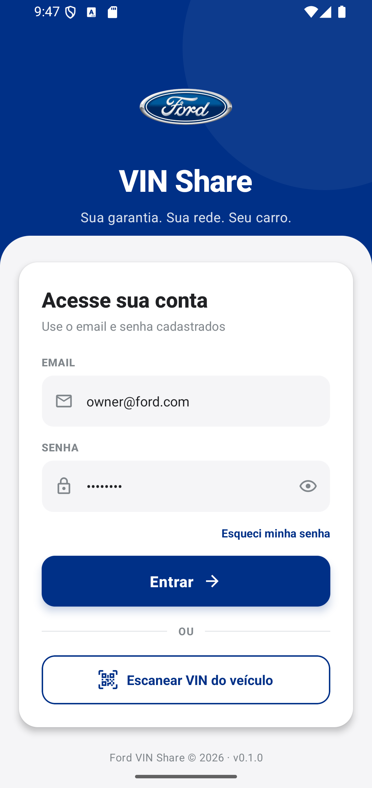<br>**Login** | 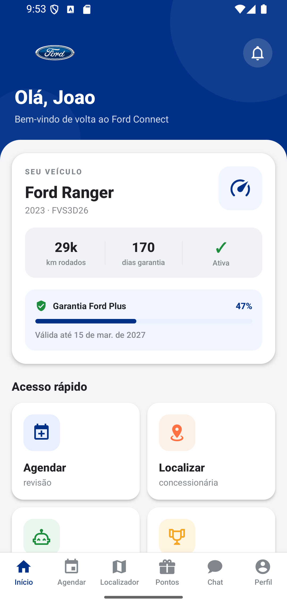<br>**Home** | 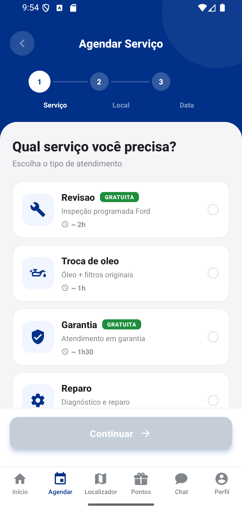<br>**Agendar** |
| 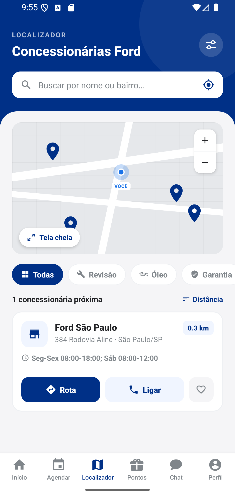<br>**Localizador** | 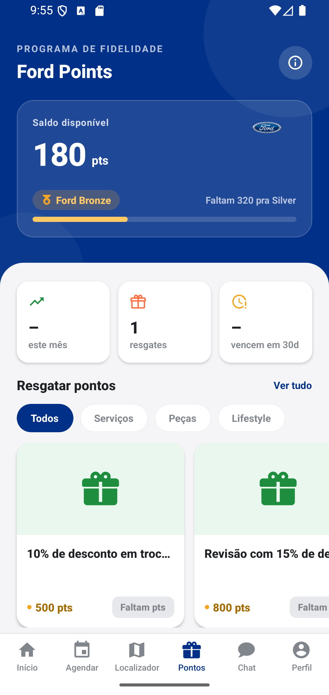<br>**Pontos** | <br>**Chat Ford AI** |
| 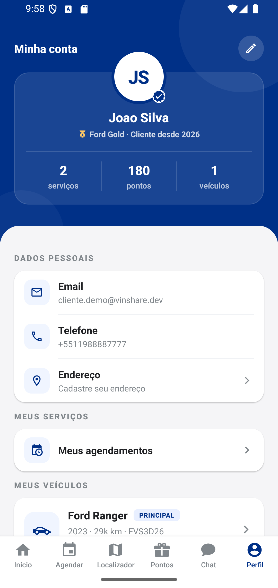<br>**Perfil** | 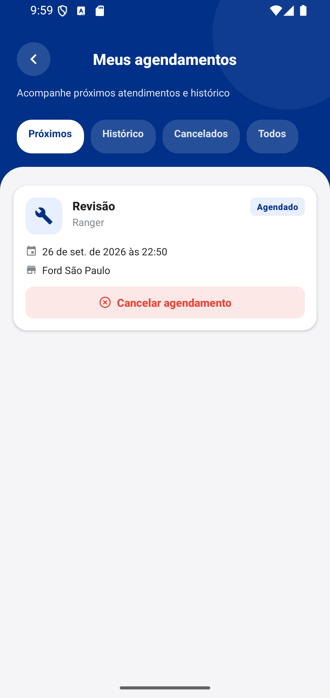<br>**Meus agendamentos** | 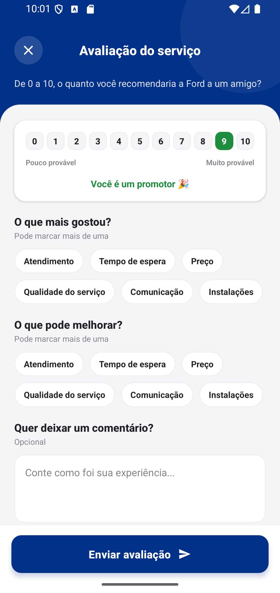<br>**Pesquisa NPS** |
| 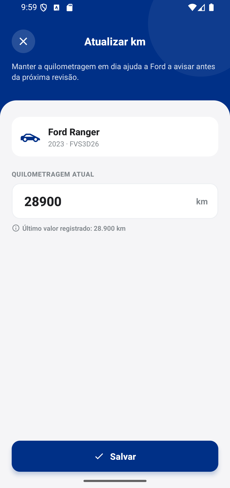<br>**Atualizar odômetro** | | |

### Analista

| | | |
|---|---|---|
| 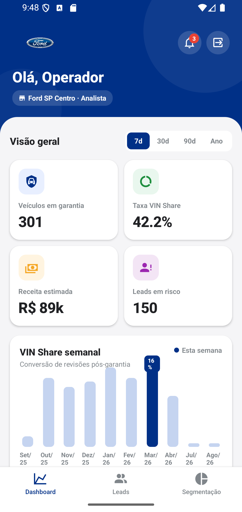<br>**Dashboard** | 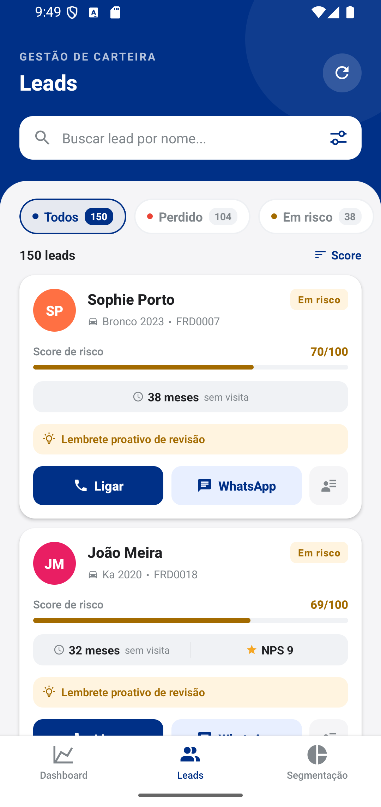<br>**Leads em risco** | 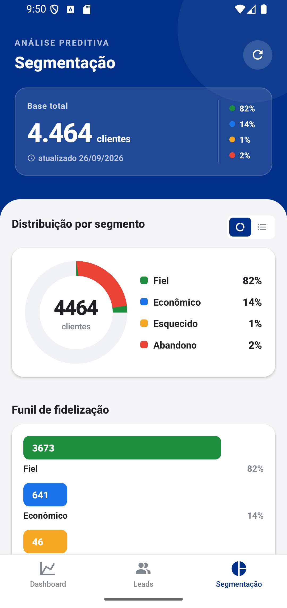<br>**Segmentação** |
| 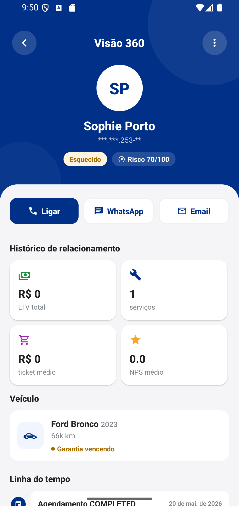<br>**Visão 360** | | |

## Identidade visual

Toda cor, espaçamento e tipografia do app vem de um lugar só:
[`src/constants/index.ts`](src/constants/index.ts). Não tem cor
"hardcoded" espalhada pelas telas — se alguém colar um hex direto num
`style`, esse grep vai apontar:

```bash
grep -rE "#[0-9a-fA-F]{3,8}" src app --include=*.tsx --include=*.ts \
  | grep -v src/constants
```

**Cores**

| Grupo | Tokens |
|---|---|
| Marca | `primary #003087` (Ford Blue) · `primaryBright #0a4bb8` · `primaryTint #f0f5ff` · `primaryTintStrong #e8efff` · `primaryBorder #c5d4f0` · `secondary #1a73e8` |
| Sucesso | `success #1e8e3e` · `successTint #e9f7ee` |
| Atenção | `warning #f5a623` · `warningStrong #ffc966` · `warningTint #fff4e0` · `warningText #a36b00` |
| Erro | `danger #ea4335` · `dangerTint #fce8e6` · `dangerText #c62828` |
| Neutros | `background #f5f5f7` · `surface #fff` · `surfaceAlt #eef0f3` · `surfaceMuted #f0f2f5` · `border #e6e8eb` · `borderStrong #c5cdd9` · `dark #202124` · `gray #80868b` |
| Categóricas | `ACCENTS` (violet, purple, purpleDark, pink, coral, teal) — usadas em avatar, categoria de prêmio e tipo de evento na timeline. Não têm significado de status. |

Os `rgba(255,255,255,x)` que aparecem sobre o hero azul são inline de
propósito: são variação de opacidade em cima do mesmo fundo, não uma cor
nova do sistema.

**Layout e tipografia**

| Token | Uso |
|---|---|
| `SPACING` | `xs 4` até `xxl 24` |
| `RADIUS` | `sm 8` · `md 12` · `lg 14` · `xl 20` · `hero 28` · `pill` |
| `SHADOWS` | `card` (opacity 0.04) e `raised` (0.06) |
| `TYPOGRAPHY` | `heroTitle` · `title` · `sectionTitle` · `body` · `label` · `caption` |
| Hero | fundo Ford Blue, blob decorativo, card branco por cima (`borderTopRadius: 28`) |
| Splash/Icon | logo oval da Ford sobre fundo `#003087` |

Os nomes de ícone são tipados (`IconName`, em `src/types`) — errou o nome
do glifo, quebra a build. Prefiro isso a descobrir um quadrado vazio depois
de instalado.

## Autenticação

`POST /auth/login` devolve `{ accessToken, refreshToken, role, userId }`.
Os tokens vão pro SecureStore, e o interceptor do axios cola o
`Authorization: Bearer …` em toda chamada sozinho. Quando dá 401, ele
dispara um `POST /auth/refresh` (só uma vez, mesmo com várias chamadas
simultâneas) e repete a requisição original; se o refresh também falhar,
limpa o SecureStore e manda de volta pro login.

A `role` vem de dentro do próprio JWT e decide se `app/index.tsx` abre em
`(client)` ou `(analyst)` — ADMIN entra como analyst.

## Modo offline

Usa `PersistQueryClientProvider` com AsyncStorage, mas só pra leitura de
baixo risco — a allowlist fica em `src/services/queryPersist.ts` e hoje
cobre `vehicles.list`, `vehicles.warranty`, `vehicles.alerts` e
`services.mine`. Cache dura 24h (`gcTime`), e existe um
`QUERY_CACHE_BUSTER` pra invalidar tudo de uma vez quando o formato de
algum desses dados muda.

## Segmentação de cliente (calculada no backend)

O score de risco (0 a 100) é feito no servidor, com essa heurística:

| Critério | Peso |
|---|---|
| Última visita há mais de 12 meses | +30 |
| Garantia vencendo em menos de 60 dias | +20 |
| NPS abaixo de 7 | +25 |
| Km perto da revisão | +15 |
| 3 ou mais serviços no último ano | −20 |
| NPS 9 ou mais | −10 |

E a faixa de score vira o `status` do lead:

- 80 ou mais → `PERDIDO`
- 60 ou mais → `EM_RISCO`
- menos de 20 → `RECUPERADO`
- o resto → `NOVO`

## Testes e qualidade

| Checagem | Comando |
|---|---|
| Type check | `npx tsc --noEmit` |
| Lint | `npm run lint` |
| Testes | `npm test` |
| Contra o backend real | `EMAIL=… PASSWORD=… bash scripts/verify-backend.sh` |

50 testes, 10 suítes. Cinco delas (`appointments`, `services`, `nps`,
`loyalty`, `customers`) nasceram de uma auditoria campo-a-campo contra o
backend em produção — o payload real de vários endpoints divergia um
pouco do que os tipos do app declaravam (nome de campo diferente, enum
diferente, sinal de número invertido em pontos de fidelidade). Cada
suíte fixa o payload real como fixture, então se o backend mudar o
formato de novo sem avisar, o teste quebra antes da tela quebrar. O caso
mais grave foi o `Customer360Screen`, que esperava `vehicles[]`,
`recentServices[]` e `activeAppointments[]` que a API nunca manda — a
tela foi simplificada pro que ela realmente devolve.

Antes de qualquer apresentação, vale rodar o smoke test contra o backend
no ar:

```bash
EMAIL=… PASSWORD=… bash scripts/verify-backend.sh
```

## Build (EAS)

O `projectId` já está configurado em `app.json`. Os três perfis do
`eas.json` geram APK, incluindo o `production`:

| Perfil | API | Uso |
|---|---|---|
| `development` | `localhost:8080` | dev client |
| `preview` | Azure | APK interno pra teste |
| `production` | Azure | entrega final, com `autoIncrement` |

```bash
npm i -g eas-cli
eas login
eas build --profile preview --platform android    # APK pra instalar direto
eas build --profile production --platform android # entrega final
```

O `production` está como `buildType: apk` porque a entrega pede um APK
instalável direto. Se um dia for pra Play Store, troca pra `app-bundle`
(a loja não aceita APK) e roda `eas submit`.
